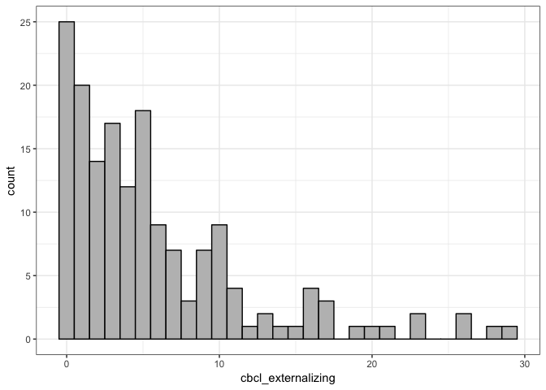
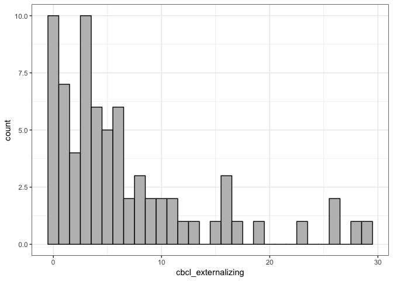
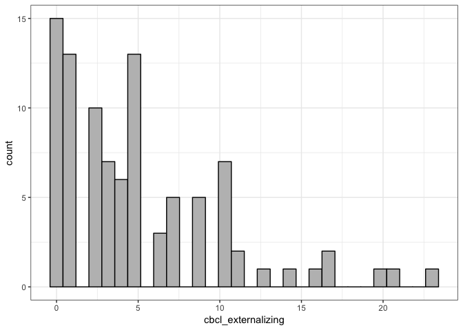
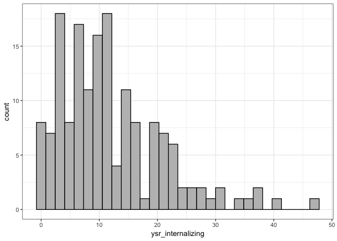
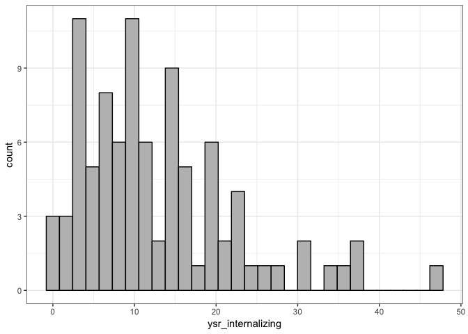
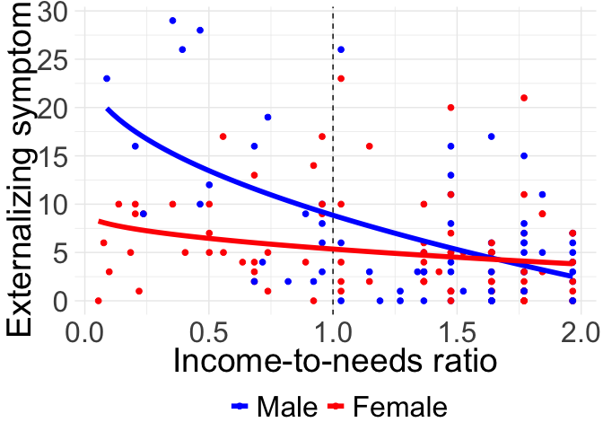
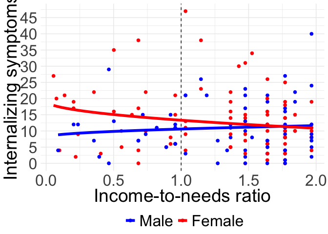
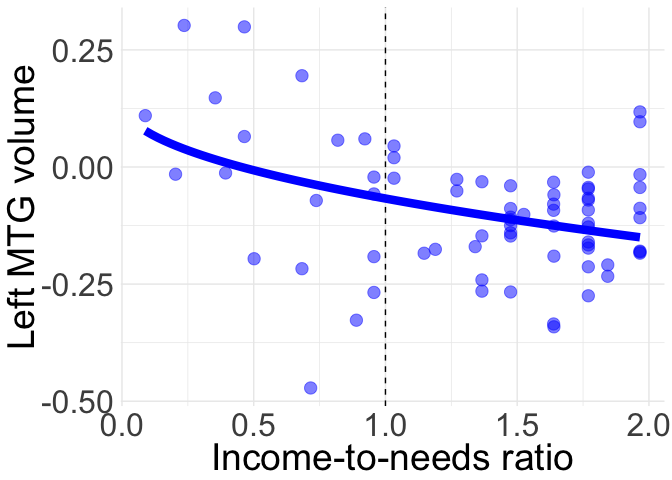
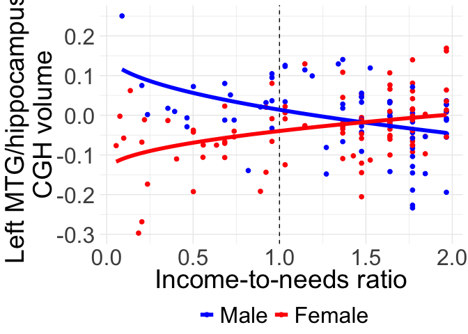

Effects of INR on T1 symptoms
================
Lucy King

-   [Join data](#join-data)
-   [Create coding for sex and race](#create-coding-for-sex-and-race)
-   [Create separate tibbles for boys and girls](#create-separate-tibbles-for-boys-and-girls)
-   [Distributions of symptoms](#distributions-of-symptoms)
-   [Externalizing](#externalizing)
-   [Internalizing](#internalizing)
-   [Visualize externalizing sex differences](#visualize-externalizing-sex-differences)
-   [Visualize mediation](#visualize-mediation)
-   [Visualize hippocampus sex differences](#visualize-hippocampus-sex-differences)
-   [Sensitivity analyses](#sensitivity-analyses)
    -   [Compare sample to those missing brain data on symptoms](#compare-sample-to-those-missing-brain-data-on-symptoms)
    -   [linear effects of INR on externalizing symptoms](#linear-effects-of-inr-on-externalizing-symptoms)
    -   [linear effects of INR on internalizing symptoms](#linear-effects-of-inr-on-internalizing-symptoms)

``` r
##Libraries
library(tidyverse)
```

    ## ── Attaching packages ───────────────────────────────────────────────────────────── tidyverse 1.2.1 ──

    ## ✔ ggplot2 3.0.0     ✔ purrr   0.2.5
    ## ✔ tibble  1.4.2     ✔ dplyr   0.7.5
    ## ✔ tidyr   0.8.1     ✔ stringr 1.3.1
    ## ✔ readr   1.1.1     ✔ forcats 0.3.0

    ## ── Conflicts ──────────────────────────────────────────────────────────────── tidyverse_conflicts() ──
    ## ✖ dplyr::filter() masks stats::filter()
    ## ✖ dplyr::lag()    masks stats::lag()

``` r
##Parameters

#files____________________________________________________________________

#parent-reported symptoms
t1_cbcl_file <- "~/Desktop/ELS/income_TBM/data/osf/ELS_T1S1_CBCL_old_1991_Final Profile Data_ID 1-218.sav" 

#child-reported symptoms
t1_ysr_file <- "~/Desktop/ELS/income_TBM/data/osf/ELS_T1S1_YSR_old_1991_Final Profile Data_ID 1-218.sav" 

#extracted estimates for all 46 ROIs identified in sex*income model
roi_inc_int_file <- "~/Desktop/ELS/income_TBM/data/osf/inc_interac_46rois_all.xlsx" 

#income-to-needs ratios
inr_file <- "~/Desktop/ELS/income_TBM/data/osf/income_to_needs.csv"

#covariates used in income TBM model
tbm_covariates_file <- "~/Desktop/ELS/income_TBM/data/osf/tbm_cov_income.csv"
```

Join data
---------

``` r
roi_symptoms <-
  readxl::read_xlsx(roi_inc_int_file, sheet = "Vols") %>% 
  left_join(read_csv(tbm_covariates_file), by = "ELS_ID") %>% 
  left_join(read_csv(inr_file), by = "ELS_ID") %>% 
  left_join(
    haven::read_sav(t1_cbcl_file, user_na = 999) %>% 
      mutate(
        ELS_ID = as.integer(ELS_ID),
        cbcl_externalizing = as.integer(
          T1_CBCL_old_Externalizing_Problems_Total_Score
        ),
        cbcl_externalizing = if_else(
          cbcl_externalizing == 999, NA_integer_, cbcl_externalizing
        )
      ) %>% 
      select(
        ELS_ID,
        cbcl_externalizing
      ), 
    by = "ELS_ID"
  ) %>% 
  left_join(
    haven::read_sav(t1_ysr_file, user_na = 999) %>% 
      mutate(
        ELS_ID = as.integer(ELS_ID),
        ysr_internalizing = as.integer(
          T1_YSR_old_Internalizing_Problems_Total_Score
        ),
        ysr_internalizing = if_else(
          ysr_internalizing == 999, NA_integer_, ysr_internalizing
        )
      ) %>% 
      select(
        ELS_ID,
        ysr_internalizing
      )
  )
```

    ## Parsed with column specification:
    ## cols(
    ##   ELS_ID = col_integer(),
    ##   Age = col_double(),
    ##   Male = col_integer(),
    ##   Tanner = col_double(),
    ##   ICV = col_double(),
    ##   White = col_integer()
    ## )

    ## Parsed with column specification:
    ## cols(
    ##   ELS_ID = col_integer(),
    ##   income_needs = col_double()
    ## )

    ## Joining, by = "ELS_ID"

Create coding for sex and race
------------------------------

``` r
roi_symptoms <-
  roi_symptoms %>% 
  mutate(
    male_simple_effect = recode(
      Male,
      "1" = "0",
      "0" = "1"
    ),
    female_simple_effect = recode(
      Male,
      "1" = "1",
      "0" = "0"
    ),
    sex_effect_coded = recode(
      Male,
      "1" = "1", #male
      "0" = "-1" #female
    ),
    white_effect_coded = recode(
      White,
      "1" = "1",
      "0" = "-1"
    )
  ) 
```

Create separate tibbles for boys and girls
------------------------------------------

``` r
#male only tibble
roi_symptoms_male <- 
  roi_symptoms %>% 
  filter(Male == 1)

#female only tibble
roi_symptoms_female <- 
  roi_symptoms %>% 
  filter(Male == 0)
```

Distributions of symptoms
-------------------------

``` r
#externalizing
roi_symptoms %>% 
  ggplot(aes(x = cbcl_externalizing)) +
  geom_histogram(bins = 30, position = "dodge", fill = "gray", color = "black") +
  theme_bw()
```



``` r
roi_symptoms_male %>% 
  ggplot(aes(x = cbcl_externalizing)) +
  geom_histogram(bins = 30, position = "dodge", fill = "gray", color = "black") +
  theme_bw()
```



``` r
roi_symptoms_female %>% 
  ggplot(aes(x = cbcl_externalizing)) +
  geom_histogram(bins = 30, position = "dodge", fill = "gray", color = "black") +
  theme_bw()
```



``` r
# internalizing
roi_symptoms %>% 
  ggplot(aes(x = ysr_internalizing)) +
  geom_histogram(bins = 30, position = "dodge", fill = "gray", color = "black") +
  theme_bw()
```

    ## Warning: Removed 3 rows containing non-finite values (stat_bin).



``` r
roi_symptoms_male %>% 
  ggplot(aes(x = ysr_internalizing)) +
  geom_histogram(bins = 30, position = "dodge", fill = "gray", color = "black") +
  theme_bw()
```

    ## Warning: Removed 1 rows containing non-finite values (stat_bin).


``` r
roi_symptoms_female %>% 
  ggplot(aes(x = ysr_internalizing)) +
  geom_histogram(bins = 30, position = "dodge", fill = "gray", color = "black") +
  theme_bw()
```

    ## Warning: Removed 2 rows containing non-finite values (stat_bin).



Externalizing
-------------

``` r
#main effect
mod_extern_income = lm(cbcl_externalizing ~ sqrt(income_needs), data = roi_symptoms)

summary(mod_extern_income)
```

    ## 
    ## Call:
    ## lm(formula = cbcl_externalizing ~ sqrt(income_needs), data = roi_symptoms)
    ## 
    ## Residuals:
    ##     Min      1Q  Median      3Q     Max 
    ## -12.486  -3.816  -1.484   1.976  19.541 
    ## 
    ## Coefficients:
    ##                    Estimate Std. Error t value Pr(>|t|)    
    ## (Intercept)          14.287      1.765   8.093 1.24e-13 ***
    ## sqrt(income_needs)   -7.705      1.546  -4.984 1.57e-06 ***
    ## ---
    ## Signif. codes:  0 '***' 0.001 '**' 0.01 '*' 0.05 '.' 0.1 ' ' 1
    ## 
    ## Residual standard error: 5.722 on 164 degrees of freedom
    ## Multiple R-squared:  0.1316, Adjusted R-squared:  0.1263 
    ## F-statistic: 24.84 on 1 and 164 DF,  p-value: 1.568e-06

``` r
AIC(mod_extern_income)
```

    ## [1] 1054.198

``` r
confint(mod_extern_income)
```

    ##                        2.5 %   97.5 %
    ## (Intercept)         10.80136 17.77291
    ## sqrt(income_needs) -10.75672 -4.65236

``` r
#interaction with sex 
mod_sex_extern_income = 
  lm(cbcl_externalizing ~ sqrt(income_needs) * sex_effect_coded, data = roi_symptoms)

summary(mod_sex_extern_income)
```

    ## 
    ## Call:
    ## lm(formula = cbcl_externalizing ~ sqrt(income_needs) * sex_effect_coded, 
    ##     data = roi_symptoms)
    ## 
    ## Residuals:
    ##    Min     1Q Median     3Q    Max 
    ## -9.588 -3.419 -1.446  2.431 17.706 
    ## 
    ## Coefficients:
    ##                                      Estimate Std. Error t value Pr(>|t|)
    ## (Intercept)                             9.131      2.056   4.442 1.64e-05
    ## sqrt(income_needs)                     -3.777      1.828  -2.067 0.040365
    ## sex_effect_coded1                      15.490      3.529   4.389 2.04e-05
    ## sqrt(income_needs):sex_effect_coded1  -11.992      3.068  -3.909 0.000136
    ##                                         
    ## (Intercept)                          ***
    ## sqrt(income_needs)                   *  
    ## sex_effect_coded1                    ***
    ## sqrt(income_needs):sex_effect_coded1 ***
    ## ---
    ## Signif. codes:  0 '***' 0.001 '**' 0.01 '*' 0.05 '.' 0.1 ' ' 1
    ## 
    ## Residual standard error: 5.411 on 162 degrees of freedom
    ## Multiple R-squared:  0.2328, Adjusted R-squared:  0.2186 
    ## F-statistic: 16.39 on 3 and 162 DF,  p-value: 2.388e-09

``` r
AIC(mod_sex_extern_income)
```

    ## [1] 1037.62

``` r
confint(mod_sex_extern_income)
```

    ##                                           2.5 %     97.5 %
    ## (Intercept)                            5.071815 13.1904185
    ## sqrt(income_needs)                    -7.385643 -0.1678931
    ## sex_effect_coded1                      8.521042 22.4585859
    ## sqrt(income_needs):sex_effect_coded1 -18.049991 -5.9343299

``` r
#interaction with TBM covariates
mod_sex_extern_income_cov = 
  lm(cbcl_externalizing ~ sqrt(income_needs) * sex_effect_coded + white_effect_coded + Tanner + Age, data = roi_symptoms)

summary(mod_sex_extern_income_cov)
```

    ## 
    ## Call:
    ## lm(formula = cbcl_externalizing ~ sqrt(income_needs) * sex_effect_coded + 
    ##     white_effect_coded + Tanner + Age, data = roi_symptoms)
    ## 
    ## Residuals:
    ##    Min     1Q Median     3Q    Max 
    ## -8.917 -3.298 -1.449  2.394 17.933 
    ## 
    ## Coefficients:
    ##                                       Estimate Std. Error t value Pr(>|t|)
    ## (Intercept)                           14.78461    5.19575   2.846  0.00502
    ## sqrt(income_needs)                    -3.23577    1.87538  -1.725  0.08640
    ## sex_effect_coded1                     16.05826    3.59286   4.469 1.48e-05
    ## white_effect_coded1                   -1.39133    0.85734  -1.623  0.10660
    ## Tanner                                 0.06376    0.64828   0.098  0.92178
    ## Age                                   -0.51410    0.46580  -1.104  0.27139
    ## sqrt(income_needs):sex_effect_coded1 -12.09344    3.09872  -3.903  0.00014
    ##                                         
    ## (Intercept)                          ** 
    ## sqrt(income_needs)                   .  
    ## sex_effect_coded1                    ***
    ## white_effect_coded1                     
    ## Tanner                                  
    ## Age                                     
    ## sqrt(income_needs):sex_effect_coded1 ***
    ## ---
    ## Signif. codes:  0 '***' 0.001 '**' 0.01 '*' 0.05 '.' 0.1 ' ' 1
    ## 
    ## Residual standard error: 5.39 on 159 degrees of freedom
    ## Multiple R-squared:  0.2529, Adjusted R-squared:  0.2247 
    ## F-statistic: 8.971 on 6 and 159 DF,  p-value: 1.936e-08

``` r
confint(mod_sex_extern_income_cov)
```

    ##                                           2.5 %     97.5 %
    ## (Intercept)                            4.523019 25.0462041
    ## sqrt(income_needs)                    -6.939641  0.4681094
    ## sex_effect_coded1                      8.962384 23.1541460
    ## white_effect_coded1                   -3.084566  0.3019122
    ## Tanner                                -1.216590  1.3441030
    ## Age                                   -1.434062  0.4058554
    ## sqrt(income_needs):sex_effect_coded1 -18.213397 -5.9734823

``` r
#simple effects

#males
mod_male_extern_income = 
  lm(cbcl_externalizing ~ sqrt(income_needs) * male_simple_effect, data = roi_symptoms)

summary(mod_male_extern_income)
```

    ## 
    ## Call:
    ## lm(formula = cbcl_externalizing ~ sqrt(income_needs) * male_simple_effect, 
    ##     data = roi_symptoms)
    ## 
    ## Residuals:
    ##    Min     1Q Median     3Q    Max 
    ## -9.588 -3.419 -1.446  2.431 17.706 
    ## 
    ## Coefficients:
    ##                                        Estimate Std. Error t value
    ## (Intercept)                              24.621      2.868   8.583
    ## sqrt(income_needs)                      -15.769      2.464  -6.400
    ## male_simple_effect1                     -15.490      3.529  -4.389
    ## sqrt(income_needs):male_simple_effect1   11.992      3.068   3.909
    ##                                        Pr(>|t|)    
    ## (Intercept)                            7.20e-15 ***
    ## sqrt(income_needs)                     1.60e-09 ***
    ## male_simple_effect1                    2.04e-05 ***
    ## sqrt(income_needs):male_simple_effect1 0.000136 ***
    ## ---
    ## Signif. codes:  0 '***' 0.001 '**' 0.01 '*' 0.05 '.' 0.1 ' ' 1
    ## 
    ## Residual standard error: 5.411 on 162 degrees of freedom
    ## Multiple R-squared:  0.2328, Adjusted R-squared:  0.2186 
    ## F-statistic: 16.39 on 3 and 162 DF,  p-value: 2.388e-09

``` r
confint(mod_male_extern_income)
```

    ##                                            2.5 %     97.5 %
    ## (Intercept)                             18.95649  30.285368
    ## sqrt(income_needs)                     -20.63445 -10.903404
    ## male_simple_effect1                    -22.45859  -8.521042
    ## sqrt(income_needs):male_simple_effect1   5.93433  18.049991

``` r
mod_male_extern_income_cov = 
  lm(cbcl_externalizing ~ sqrt(income_needs) * male_simple_effect + white_effect_coded + Tanner + Age, data = roi_symptoms)

summary(mod_male_extern_income_cov)
```

    ## 
    ## Call:
    ## lm(formula = cbcl_externalizing ~ sqrt(income_needs) * male_simple_effect + 
    ##     white_effect_coded + Tanner + Age, data = roi_symptoms)
    ## 
    ## Residuals:
    ##    Min     1Q Median     3Q    Max 
    ## -8.917 -3.298 -1.449  2.394 17.933 
    ## 
    ## Coefficients:
    ##                                         Estimate Std. Error t value
    ## (Intercept)                             30.84288    5.67936   5.431
    ## sqrt(income_needs)                     -15.32921    2.46955  -6.207
    ## male_simple_effect1                    -16.05826    3.59286  -4.469
    ## white_effect_coded1                     -1.39133    0.85734  -1.623
    ## Tanner                                   0.06376    0.64828   0.098
    ## Age                                     -0.51410    0.46580  -1.104
    ## sqrt(income_needs):male_simple_effect1  12.09344    3.09872   3.903
    ##                                        Pr(>|t|)    
    ## (Intercept)                            2.07e-07 ***
    ## sqrt(income_needs)                     4.50e-09 ***
    ## male_simple_effect1                    1.48e-05 ***
    ## white_effect_coded1                     0.10660    
    ## Tanner                                  0.92178    
    ## Age                                     0.27139    
    ## sqrt(income_needs):male_simple_effect1  0.00014 ***
    ## ---
    ## Signif. codes:  0 '***' 0.001 '**' 0.01 '*' 0.05 '.' 0.1 ' ' 1
    ## 
    ## Residual standard error: 5.39 on 159 degrees of freedom
    ## Multiple R-squared:  0.2529, Adjusted R-squared:  0.2247 
    ## F-statistic: 8.971 on 6 and 159 DF,  p-value: 1.936e-08

``` r
confint(mod_male_extern_income_cov)
```

    ##                                             2.5 %      97.5 %
    ## (Intercept)                             19.626164  42.0595886
    ## sqrt(income_needs)                     -20.206555 -10.4518552
    ## male_simple_effect1                    -23.154146  -8.9623837
    ## white_effect_coded1                     -3.084566   0.3019122
    ## Tanner                                  -1.216590   1.3441030
    ## Age                                     -1.434062   0.4058554
    ## sqrt(income_needs):male_simple_effect1   5.973482  18.2133968

``` r
summary(lm(cbcl_externalizing ~ sqrt(income_needs), data = roi_symptoms_male))
```

    ## 
    ## Call:
    ## lm(formula = cbcl_externalizing ~ sqrt(income_needs), data = roi_symptoms_male)
    ## 
    ## Residuals:
    ##    Min     1Q Median     3Q    Max 
    ## -9.588 -3.942 -1.195  2.499 17.402 
    ## 
    ## Coefficients:
    ##                    Estimate Std. Error t value Pr(>|t|)    
    ## (Intercept)          24.621      3.138   7.846 3.51e-11 ***
    ## sqrt(income_needs)  -15.769      2.695  -5.850 1.44e-07 ***
    ## ---
    ## Signif. codes:  0 '***' 0.001 '**' 0.01 '*' 0.05 '.' 0.1 ' ' 1
    ## 
    ## Residual standard error: 5.92 on 70 degrees of freedom
    ## Multiple R-squared:  0.3284, Adjusted R-squared:  0.3188 
    ## F-statistic: 34.23 on 1 and 70 DF,  p-value: 1.436e-07

``` r
summary(lm(cbcl_externalizing ~ sqrt(income_needs) + white_effect_coded + Tanner + Age, data = roi_symptoms_male))
```

    ## 
    ## Call:
    ## lm(formula = cbcl_externalizing ~ sqrt(income_needs) + white_effect_coded + 
    ##     Tanner + Age, data = roi_symptoms_male)
    ## 
    ## Residuals:
    ##     Min      1Q  Median      3Q     Max 
    ## -8.9997 -4.2350 -0.7369  2.4834 16.1493 
    ## 
    ## Coefficients:
    ##                      Estimate Std. Error t value Pr(>|t|)    
    ## (Intercept)          26.69051    9.08289   2.939  0.00452 ** 
    ## sqrt(income_needs)  -15.34922    2.71555  -5.652 3.53e-07 ***
    ## white_effect_coded1  -2.64943    1.39618  -1.898  0.06206 .  
    ## Tanner               -0.54279    1.12172  -0.484  0.63004    
    ## Age                  -0.01158    0.81347  -0.014  0.98869    
    ## ---
    ## Signif. codes:  0 '***' 0.001 '**' 0.01 '*' 0.05 '.' 0.1 ' ' 1
    ## 
    ## Residual standard error: 5.873 on 67 degrees of freedom
    ## Multiple R-squared:  0.3672, Adjusted R-squared:  0.3294 
    ## F-statistic: 9.721 on 4 and 67 DF,  p-value: 2.923e-06

``` r
#females
mod_female_extern_income = 
  lm(cbcl_externalizing ~ sqrt(income_needs) * female_simple_effect, data = roi_symptoms)

summary(mod_female_extern_income)
```

    ## 
    ## Call:
    ## lm(formula = cbcl_externalizing ~ sqrt(income_needs) * female_simple_effect, 
    ##     data = roi_symptoms)
    ## 
    ## Residuals:
    ##    Min     1Q Median     3Q    Max 
    ## -9.588 -3.419 -1.446  2.431 17.706 
    ## 
    ## Coefficients:
    ##                                          Estimate Std. Error t value
    ## (Intercept)                                 9.131      2.056   4.442
    ## sqrt(income_needs)                         -3.777      1.828  -2.067
    ## female_simple_effect1                      15.490      3.529   4.389
    ## sqrt(income_needs):female_simple_effect1  -11.992      3.068  -3.909
    ##                                          Pr(>|t|)    
    ## (Intercept)                              1.64e-05 ***
    ## sqrt(income_needs)                       0.040365 *  
    ## female_simple_effect1                    2.04e-05 ***
    ## sqrt(income_needs):female_simple_effect1 0.000136 ***
    ## ---
    ## Signif. codes:  0 '***' 0.001 '**' 0.01 '*' 0.05 '.' 0.1 ' ' 1
    ## 
    ## Residual standard error: 5.411 on 162 degrees of freedom
    ## Multiple R-squared:  0.2328, Adjusted R-squared:  0.2186 
    ## F-statistic: 16.39 on 3 and 162 DF,  p-value: 2.388e-09

``` r
confint(mod_female_extern_income)
```

    ##                                               2.5 %     97.5 %
    ## (Intercept)                                5.071815 13.1904185
    ## sqrt(income_needs)                        -7.385643 -0.1678931
    ## female_simple_effect1                      8.521042 22.4585859
    ## sqrt(income_needs):female_simple_effect1 -18.049991 -5.9343299

``` r
mod_female_extern_income_cov = 
  lm(cbcl_externalizing ~ sqrt(income_needs) * female_simple_effect +  white_effect_coded + Tanner + Age, data = roi_symptoms)

summary(mod_female_extern_income_cov)
```

    ## 
    ## Call:
    ## lm(formula = cbcl_externalizing ~ sqrt(income_needs) * female_simple_effect + 
    ##     white_effect_coded + Tanner + Age, data = roi_symptoms)
    ## 
    ## Residuals:
    ##    Min     1Q Median     3Q    Max 
    ## -8.917 -3.298 -1.449  2.394 17.933 
    ## 
    ## Coefficients:
    ##                                           Estimate Std. Error t value
    ## (Intercept)                               14.78461    5.19575   2.846
    ## sqrt(income_needs)                        -3.23577    1.87538  -1.725
    ## female_simple_effect1                     16.05826    3.59286   4.469
    ## white_effect_coded1                       -1.39133    0.85734  -1.623
    ## Tanner                                     0.06376    0.64828   0.098
    ## Age                                       -0.51410    0.46580  -1.104
    ## sqrt(income_needs):female_simple_effect1 -12.09344    3.09872  -3.903
    ##                                          Pr(>|t|)    
    ## (Intercept)                               0.00502 ** 
    ## sqrt(income_needs)                        0.08640 .  
    ## female_simple_effect1                    1.48e-05 ***
    ## white_effect_coded1                       0.10660    
    ## Tanner                                    0.92178    
    ## Age                                       0.27139    
    ## sqrt(income_needs):female_simple_effect1  0.00014 ***
    ## ---
    ## Signif. codes:  0 '***' 0.001 '**' 0.01 '*' 0.05 '.' 0.1 ' ' 1
    ## 
    ## Residual standard error: 5.39 on 159 degrees of freedom
    ## Multiple R-squared:  0.2529, Adjusted R-squared:  0.2247 
    ## F-statistic: 8.971 on 6 and 159 DF,  p-value: 1.936e-08

``` r
confint(mod_female_extern_income_cov)
```

    ##                                               2.5 %     97.5 %
    ## (Intercept)                                4.523019 25.0462041
    ## sqrt(income_needs)                        -6.939641  0.4681094
    ## female_simple_effect1                      8.962384 23.1541460
    ## white_effect_coded1                       -3.084566  0.3019122
    ## Tanner                                    -1.216590  1.3441030
    ## Age                                       -1.434062  0.4058554
    ## sqrt(income_needs):female_simple_effect1 -18.213397 -5.9734823

``` r
summary(lm(cbcl_externalizing ~ sqrt(income_needs), data = roi_symptoms_female))
```

    ## 
    ## Call:
    ## lm(formula = cbcl_externalizing ~ sqrt(income_needs), data = roi_symptoms_female)
    ## 
    ## Residuals:
    ##    Min     1Q Median     3Q    Max 
    ## -8.248 -3.295 -1.594  2.125 17.706 
    ## 
    ## Coefficients:
    ##                    Estimate Std. Error t value Pr(>|t|)    
    ## (Intercept)           9.131      1.896   4.817 5.71e-06 ***
    ## sqrt(income_needs)   -3.777      1.685  -2.241   0.0274 *  
    ## ---
    ## Signif. codes:  0 '***' 0.001 '**' 0.01 '*' 0.05 '.' 0.1 ' ' 1
    ## 
    ## Residual standard error: 4.99 on 92 degrees of freedom
    ## Multiple R-squared:  0.05177,    Adjusted R-squared:  0.04146 
    ## F-statistic: 5.023 on 1 and 92 DF,  p-value: 0.02742

``` r
summary(lm(cbcl_externalizing ~ sqrt(income_needs) +  white_effect_coded + Tanner + Age, data = roi_symptoms_female))
```

    ## 
    ## Call:
    ## lm(formula = cbcl_externalizing ~ sqrt(income_needs) + white_effect_coded + 
    ##     Tanner + Age, data = roi_symptoms_female)
    ## 
    ## Residuals:
    ##    Min     1Q Median     3Q    Max 
    ## -8.864 -3.005 -1.799  1.801 16.983 
    ## 
    ## Coefficients:
    ##                     Estimate Std. Error t value Pr(>|t|)   
    ## (Intercept)          17.1380     6.0115   2.851  0.00542 **
    ## sqrt(income_needs)   -3.4292     1.7822  -1.924  0.05754 . 
    ## white_effect_coded1  -0.4234     1.0733  -0.394  0.69418   
    ## Tanner                0.3890     0.7770   0.501  0.61788   
    ## Age                  -0.8096     0.5541  -1.461  0.14751   
    ## ---
    ## Signif. codes:  0 '***' 0.001 '**' 0.01 '*' 0.05 '.' 0.1 ' ' 1
    ## 
    ## Residual standard error: 5.009 on 89 degrees of freedom
    ## Multiple R-squared:  0.07581,    Adjusted R-squared:  0.03428 
    ## F-statistic: 1.825 on 4 and 89 DF,  p-value: 0.131

Internalizing
-------------

``` r
#main effect
mod_intern_income = lm(ysr_internalizing ~ sqrt(income_needs), data = roi_symptoms)

summary(mod_intern_income)
```

    ## 
    ## Call:
    ## lm(formula = ysr_internalizing ~ sqrt(income_needs), data = roi_symptoms)
    ## 
    ## Residuals:
    ##     Min      1Q  Median      3Q     Max 
    ## -13.266  -6.426  -1.583   4.392  34.756 
    ## 
    ## Coefficients:
    ##                    Estimate Std. Error t value Pr(>|t|)    
    ## (Intercept)          15.347      2.822   5.439 1.96e-07 ***
    ## sqrt(income_needs)   -3.054      2.463  -1.240    0.217    
    ## ---
    ## Signif. codes:  0 '***' 0.001 '**' 0.01 '*' 0.05 '.' 0.1 ' ' 1
    ## 
    ## Residual standard error: 8.881 on 161 degrees of freedom
    ##   (3 observations deleted due to missingness)
    ## Multiple R-squared:  0.009454,   Adjusted R-squared:  0.003302 
    ## F-statistic: 1.537 on 1 and 161 DF,  p-value: 0.2169

``` r
AIC(mod_intern_income)
```

    ## [1] 1178.506

``` r
confint(mod_intern_income)
```

    ##                        2.5 %    97.5 %
    ## (Intercept)         9.774686 20.919007
    ## sqrt(income_needs) -7.918241  1.811019

``` r
#interaction with sex 
mod_sex_intern_income = 
  lm(ysr_internalizing ~ sqrt(income_needs) * sex_effect_coded, data = roi_symptoms)

summary(mod_sex_intern_income)
```

    ## 
    ## Call:
    ## lm(formula = ysr_internalizing ~ sqrt(income_needs) * sex_effect_coded, 
    ##     data = roi_symptoms)
    ## 
    ## Residuals:
    ##     Min      1Q  Median      3Q     Max 
    ## -14.497  -6.462  -1.301   3.874  33.786 
    ## 
    ## Coefficients:
    ##                                      Estimate Std. Error t value Pr(>|t|)
    ## (Intercept)                            19.294      3.493   5.523 1.33e-07
    ## sqrt(income_needs)                     -5.983      3.081  -1.942   0.0539
    ## sex_effect_coded1                     -11.233      5.852  -1.920   0.0567
    ## sqrt(income_needs):sex_effect_coded1    8.519      5.085   1.675   0.0958
    ##                                         
    ## (Intercept)                          ***
    ## sqrt(income_needs)                   .  
    ## sex_effect_coded1                    .  
    ## sqrt(income_needs):sex_effect_coded1 .  
    ## ---
    ## Signif. codes:  0 '***' 0.001 '**' 0.01 '*' 0.05 '.' 0.1 ' ' 1
    ## 
    ## Residual standard error: 8.818 on 159 degrees of freedom
    ##   (3 observations deleted due to missingness)
    ## Multiple R-squared:  0.03561,    Adjusted R-squared:  0.01742 
    ## F-statistic: 1.957 on 3 and 159 DF,  p-value: 0.1226

``` r
AIC(mod_sex_intern_income)
```

    ## [1] 1178.144

``` r
confint(mod_sex_intern_income)
```

    ##                                           2.5 %     97.5 %
    ## (Intercept)                           12.394651 26.1926965
    ## sqrt(income_needs)                   -12.068389  0.1025463
    ## sex_effect_coded1                    -22.789934  0.3238051
    ## sqrt(income_needs):sex_effect_coded1  -1.524181 18.5620065

``` r
#interaction with TBM covariates
mod_sex_intern_income_cov = 
  lm(ysr_internalizing ~ sqrt(income_needs) * sex_effect_coded + white_effect_coded + Tanner + Age, data = roi_symptoms)

summary(mod_sex_intern_income_cov)
```

    ## 
    ## Call:
    ## lm(formula = ysr_internalizing ~ sqrt(income_needs) * sex_effect_coded + 
    ##     white_effect_coded + Tanner + Age, data = roi_symptoms)
    ## 
    ## Residuals:
    ##     Min      1Q  Median      3Q     Max 
    ## -13.531  -6.106  -1.261   3.678  33.683 
    ## 
    ## Coefficients:
    ##                                      Estimate Std. Error t value Pr(>|t|)
    ## (Intercept)                           17.9218     8.5968   2.085   0.0387
    ## sqrt(income_needs)                    -4.8539     3.1575  -1.537   0.1263
    ## sex_effect_coded1                     -9.2920     5.9709  -1.556   0.1217
    ## white_effect_coded1                   -1.3862     1.4098  -0.983   0.3270
    ## Tanner                                 1.5630     1.0704   1.460   0.1462
    ## Age                                   -0.2170     0.7654  -0.283   0.7772
    ## sqrt(income_needs):sex_effect_coded1   7.2340     5.1538   1.404   0.1624
    ##                                       
    ## (Intercept)                          *
    ## sqrt(income_needs)                    
    ## sex_effect_coded1                     
    ## white_effect_coded1                   
    ## Tanner                                
    ## Age                                   
    ## sqrt(income_needs):sex_effect_coded1  
    ## ---
    ## Signif. codes:  0 '***' 0.001 '**' 0.01 '*' 0.05 '.' 0.1 ' ' 1
    ## 
    ## Residual standard error: 8.821 on 156 degrees of freedom
    ##   (3 observations deleted due to missingness)
    ## Multiple R-squared:  0.05313,    Adjusted R-squared:  0.01671 
    ## F-statistic: 1.459 on 6 and 156 DF,  p-value: 0.1958

``` r
confint(mod_sex_intern_income_cov)
```

    ##                                            2.5 %    97.5 %
    ## (Intercept)                            0.9406107 34.902968
    ## sqrt(income_needs)                   -11.0909592  1.383067
    ## sex_effect_coded1                    -21.0863124  2.502349
    ## white_effect_coded1                   -4.1708722  1.398536
    ## Tanner                                -0.5512668  3.677239
    ## Age                                   -1.7289155  1.294977
    ## sqrt(income_needs):sex_effect_coded1  -2.9461325 17.414184

Visualize externalizing sex differences
---------------------------------------

``` r
#externalizing 
roi_symptoms %>%
  mutate(
    Sex = factor(
      Male,
      levels = c("0", "1"),
      labels = c("Female", "Male")
    )
  ) %>% 
  ggplot(aes(income_needs, cbcl_externalizing, color = fct_rev(Sex))) +
  geom_point(size = 2) +
  geom_vline(xintercept = 1, linetype = "dashed") +
  geom_smooth(method = "lm", formula = y ~ sqrt(x), size = 2, se = FALSE) +
  scale_y_continuous(breaks = seq(0, 30, 5)) +
  scale_color_manual(values = c("blue", "red")) +
  theme_minimal() +
  theme(
    legend.position = "bottom",
    legend.text = element_text(size = 24),
    axis.title = element_text(size = 28),
    axis.text = element_text(size = 24)
  ) +
  labs(
    color = NULL,
    x = "Income-to-needs ratio",
    y = "Externalizing symptoms"
  )
```



``` r
ggsave(
  "~/Desktop/ELS/income_TBM/income_TBM_sync/plots/inr_sex_externalizing.jpeg",
  width = 8,
  height = 8
  )
```

``` r
#internalizing 
roi_symptoms %>%
  mutate(
    Sex = factor(
      Male,
      levels = c("0", "1"),
      labels = c("Female", "Male")
    )
  ) %>% 
  ggplot(aes(income_needs, ysr_internalizing, color = fct_rev(Sex))) +
  geom_point(size = 2) +
  geom_vline(xintercept = 1, linetype = "dashed") +
  geom_smooth(method = "lm", formula = y ~ sqrt(x), size = 2, se = FALSE) +
  scale_y_continuous(breaks = seq(0, 45, 5)) +
  scale_color_manual(values = c("blue", "red")) +
  theme_minimal() +
  theme(
    legend.position = "bottom",
    legend.text = element_text(size = 24),
    axis.title = element_text(size = 28),
    axis.text = element_text(size = 24)
  ) +
  labs(
    color = NULL,
    x = "Income-to-needs ratio",
    y = "Internalizing symptoms"
  )
```

    ## Warning: Removed 3 rows containing non-finite values (stat_smooth).

    ## Warning: Removed 3 rows containing missing values (geom_point).



``` r
ggsave(
  "~/Desktop/ELS/income_TBM/income_TBM_sync/plots/inr_sex_internalizing.jpeg",
  width = 8,
  height = 8
  )
```

    ## Warning: Removed 3 rows containing non-finite values (stat_smooth).

    ## Warning: Removed 3 rows containing missing values (geom_point).

Visualize mediation
-------------------

``` r
roi_symptoms %>% 
  filter(Male == 1) %>% 
  ggplot(aes(income_needs, Neg_18)) +
  geom_vline(xintercept = 1, linetype = "dashed") +
  geom_point(size = 4, color = "blue", alpha = 1/2) +
  geom_smooth(
    method = "lm", 
    formula = y ~ sqrt(x), 
    se = FALSE, 
    size = 3,
    color = "blue"
    ) +
  theme_minimal() +
  theme(
    legend.text = element_text(size = 24),
    axis.title = element_text(size = 28),
    axis.text = element_text(size = 24)
  ) +
  labs(
    x = "Income-to-needs ratio",
    y = "Left MTG volume"
  )
```



``` r
ggsave(
  "~/Desktop/ELS/income_TBM/income_TBM_sync/plots/inr_mtg_boys.jpeg",
  width = 8,
  height = 8
  )
```

``` r
roi_symptoms %>% 
  filter(Male == 1) %>% 
  ggplot(aes(Neg_18, cbcl_externalizing)) +
  geom_point(size = 4, color = "blue", alpha = 1/2) +
  geom_smooth(
    method = "lm", 
    se = FALSE, 
    size = 3,
    color = "blue"
    ) +
  theme_minimal() +
  theme(
    legend.text = element_text(size = 24),
    axis.title = element_text(size = 28),
    axis.text = element_text(size = 24)
  ) +
  labs(
    x = "Left MTG volume",
    y = "Externalizing symptpms"
  )
```


``` r
ggsave(
  "~/Desktop/ELS/income_TBM/income_TBM_sync/plots/mtg_extern_boys.jpeg",
  width = 8,
  height = 8
  )
```

Visualize hippocampus sex differences
-------------------------------------

``` r
roi_symptoms %>%
  mutate(
    Sex = factor(
      Male,
      levels = c("0", "1"),
      labels = c("Female", "Male")
    )
  ) %>% 
  ggplot(aes(income_needs, Neg_39, color = fct_rev(Sex))) +
  geom_point(size = 2) +
  geom_vline(xintercept = 1, linetype = "dashed") +
  geom_smooth(method = "lm", formula = y ~ sqrt(x), size = 2, se = FALSE) +
  scale_color_manual(values = c("blue", "red")) +
  theme_minimal() +
  theme(
    legend.position = "bottom",
    legend.text = element_text(size = 24),
    axis.title = element_text(size = 28),
    axis.text = element_text(size = 24)
  ) +
  labs(
    color = NULL,
    x = "Income-to-needs ratio",
    y = "Left MTG/hippocampus/\nCGH volume"
  )
```



``` r
ggsave(
  "~/Desktop/ELS/income_TBM/income_TBM_sync/plots/inr_sex_left_hipp.jpeg",
  width = 8,
  height = 8
  )
```

Sensitivity analyses
--------------------

### Compare sample to those missing brain data on symptoms

``` r
symptoms_roi <-
  haven::read_sav(t1_cbcl_file, user_na = 999) %>% 
  mutate(
    ELS_ID = as.integer(ELS_ID),
    cbcl_externalizing = as.integer(
      T1_CBCL_old_Externalizing_Problems_Total_Score
    ),
    cbcl_externalizing = if_else(
      cbcl_externalizing == 999, NA_integer_, cbcl_externalizing
    )
  ) %>% 
  select(ELS_ID, cbcl_externalizing) %>% 
  left_join(
    haven::read_sav(t1_ysr_file, user_na = 999) %>% 
      mutate(
        ELS_ID = as.integer(ELS_ID),
        ysr_internalizing = as.integer(
          T1_YSR_old_Internalizing_Problems_Total_Score
        ),
        ysr_internalizing = if_else(
          ysr_internalizing == 999, NA_integer_, ysr_internalizing
        )
      ) %>% 
      select(ELS_ID, ysr_internalizing),
    by = "ELS_ID"
  ) %>% 
  left_join(
    read_csv(tbm_covariates_file) %>% 
      select(
        ELS_ID,
        included = ICV
      ), 
    by = "ELS_ID"
  ) %>% 
  mutate(
    included = if_else(
      !is.na(included), 
      "included", "not"
    )
  )
```

    ## Parsed with column specification:
    ## cols(
    ##   ELS_ID = col_integer(),
    ##   Age = col_double(),
    ##   Male = col_integer(),
    ##   Tanner = col_double(),
    ##   ICV = col_double(),
    ##   White = col_integer()
    ## )

``` r
t.test(symptoms_roi$ysr_internalizing ~ symptoms_roi$included)
```

    ## 
    ##  Welch Two Sample t-test
    ## 
    ## data:  symptoms_roi$ysr_internalizing by symptoms_roi$included
    ## t = -0.26548, df = 63.777, p-value = 0.7915
    ## alternative hypothesis: true difference in means is not equal to 0
    ## 95 percent confidence interval:
    ##  -3.776344  2.890455
    ## sample estimates:
    ## mean in group included      mean in group not 
    ##               11.95706               12.40000

``` r
t.test(symptoms_roi$cbcl_externalizing ~ symptoms_roi$included)
```

    ## 
    ##  Welch Two Sample t-test
    ## 
    ## data:  symptoms_roi$cbcl_externalizing by symptoms_roi$included
    ## t = -0.45765, df = 66.474, p-value = 0.6487
    ## alternative hypothesis: true difference in means is not equal to 0
    ## 95 percent confidence interval:
    ##  -2.657325  1.666160
    ## sample estimates:
    ## mean in group included      mean in group not 
    ##               5.771084               6.266667

### linear effects of INR on externalizing symptoms

``` r
#linear main effect
mod_extern_income_lin = lm(cbcl_externalizing ~ income_needs, data = roi_symptoms)

summary(mod_extern_income_lin)
```

    ## 
    ## Call:
    ## lm(formula = cbcl_externalizing ~ income_needs, data = roi_symptoms)
    ## 
    ## Residuals:
    ##     Min      1Q  Median      3Q     Max 
    ## -11.037  -3.809  -1.318   2.000  19.225 
    ## 
    ## Coefficients:
    ##              Estimate Std. Error t value Pr(>|t|)    
    ## (Intercept)   11.2668     1.1522   9.778  < 2e-16 ***
    ## income_needs  -4.2135     0.8158  -5.165 6.91e-07 ***
    ## ---
    ## Signif. codes:  0 '***' 0.001 '**' 0.01 '*' 0.05 '.' 0.1 ' ' 1
    ## 
    ## Residual standard error: 5.695 on 164 degrees of freedom
    ## Multiple R-squared:  0.1399, Adjusted R-squared:  0.1346 
    ## F-statistic: 26.67 on 1 and 164 DF,  p-value: 6.909e-07

``` r
AIC(mod_extern_income_lin)
```

    ## [1] 1052.597

``` r
confint(mod_extern_income_lin)
```

    ##                  2.5 %   97.5 %
    ## (Intercept)   8.991666 13.54194
    ## income_needs -5.824416 -2.60263

``` r
#linear interaction with sex
mod_sex_extern_income_lin = 
  lm(cbcl_externalizing ~ income_needs * sex_effect_coded, data = roi_symptoms)

summary(mod_sex_extern_income_lin)
```

    ## 
    ## Call:
    ## lm(formula = cbcl_externalizing ~ income_needs * sex_effect_coded, 
    ##     data = roi_symptoms)
    ## 
    ## Residuals:
    ##    Min     1Q Median     3Q    Max 
    ## -9.786 -3.579 -1.619  2.400 17.404 
    ## 
    ## Coefficients:
    ##                                Estimate Std. Error t value Pr(>|t|)    
    ## (Intercept)                       8.051      1.389   5.797 3.43e-08 ***
    ## income_needs                     -2.378      1.003  -2.370  0.01895 *  
    ## sex_effect_coded1                 8.879      2.297   3.865  0.00016 ***
    ## income_needs:sex_effect_coded1   -5.154      1.613  -3.194  0.00169 ** 
    ## ---
    ## Signif. codes:  0 '***' 0.001 '**' 0.01 '*' 0.05 '.' 0.1 ' ' 1
    ## 
    ## Residual standard error: 5.466 on 162 degrees of freedom
    ## Multiple R-squared:  0.2173, Adjusted R-squared:  0.2029 
    ## F-statistic:    15 on 3 and 162 DF,  p-value: 1.163e-08

``` r
AIC(mod_sex_extern_income_lin)
```

    ## [1] 1040.931

``` r
confint(mod_sex_extern_income_lin)
```

    ##                                    2.5 %     97.5 %
    ## (Intercept)                     5.308590 10.7933177
    ## income_needs                   -4.358725 -0.3968902
    ## sex_effect_coded1               4.343040 13.4158285
    ## income_needs:sex_effect_coded1 -8.340095 -1.9677113

``` r
#simple effects

#males
mod_male_extern_income_lin = 
  lm(cbcl_externalizing ~ income_needs * male_simple_effect, data = roi_symptoms)
summary(mod_male_extern_income_lin)
```

    ## 
    ## Call:
    ## lm(formula = cbcl_externalizing ~ income_needs * male_simple_effect, 
    ##     data = roi_symptoms)
    ## 
    ## Residuals:
    ##    Min     1Q Median     3Q    Max 
    ## -9.786 -3.579 -1.619  2.400 17.404 
    ## 
    ## Coefficients:
    ##                                  Estimate Std. Error t value Pr(>|t|)    
    ## (Intercept)                        16.930      1.830   9.252  < 2e-16 ***
    ## income_needs                       -7.532      1.264  -5.960 1.53e-08 ***
    ## male_simple_effect1                -8.879      2.297  -3.865  0.00016 ***
    ## income_needs:male_simple_effect1    5.154      1.613   3.194  0.00169 ** 
    ## ---
    ## Signif. codes:  0 '***' 0.001 '**' 0.01 '*' 0.05 '.' 0.1 ' ' 1
    ## 
    ## Residual standard error: 5.466 on 162 degrees of freedom
    ## Multiple R-squared:  0.2173, Adjusted R-squared:  0.2029 
    ## F-statistic:    15 on 3 and 162 DF,  p-value: 1.163e-08

``` r
confint(mod_male_extern_income_lin)
```

    ##                                       2.5 %    97.5 %
    ## (Intercept)                       13.316760 20.544017
    ## income_needs                     -10.027264 -5.036158
    ## male_simple_effect1              -13.415829 -4.343040
    ## income_needs:male_simple_effect1   1.967711  8.340095

``` r
summary(lm(cbcl_externalizing ~ income_needs, data = roi_symptoms_male))
```

    ## 
    ## Call:
    ## lm(formula = cbcl_externalizing ~ income_needs, data = roi_symptoms_male)
    ## 
    ## Residuals:
    ##    Min     1Q Median     3Q    Max 
    ## -9.786 -3.986 -1.192  2.519 16.846 
    ## 
    ## Coefficients:
    ##              Estimate Std. Error t value Pr(>|t|)    
    ## (Intercept)    16.930      2.037   8.311 4.89e-12 ***
    ## income_needs   -7.532      1.407  -5.354 1.04e-06 ***
    ## ---
    ## Signif. codes:  0 '***' 0.001 '**' 0.01 '*' 0.05 '.' 0.1 ' ' 1
    ## 
    ## Residual standard error: 6.084 on 70 degrees of freedom
    ## Multiple R-squared:  0.2905, Adjusted R-squared:  0.2804 
    ## F-statistic: 28.66 on 1 and 70 DF,  p-value: 1.037e-06

``` r
#females
mod_female_extern_income_lin = 
  lm(cbcl_externalizing ~ income_needs * female_simple_effect, data = roi_symptoms)
summary(mod_female_extern_income_lin)
```

    ## 
    ## Call:
    ## lm(formula = cbcl_externalizing ~ income_needs * female_simple_effect, 
    ##     data = roi_symptoms)
    ## 
    ## Residuals:
    ##    Min     1Q Median     3Q    Max 
    ## -9.786 -3.579 -1.619  2.400 17.404 
    ## 
    ## Coefficients:
    ##                                    Estimate Std. Error t value Pr(>|t|)
    ## (Intercept)                           8.051      1.389   5.797 3.43e-08
    ## income_needs                         -2.378      1.003  -2.370  0.01895
    ## female_simple_effect1                 8.879      2.297   3.865  0.00016
    ## income_needs:female_simple_effect1   -5.154      1.613  -3.194  0.00169
    ##                                       
    ## (Intercept)                        ***
    ## income_needs                       *  
    ## female_simple_effect1              ***
    ## income_needs:female_simple_effect1 ** 
    ## ---
    ## Signif. codes:  0 '***' 0.001 '**' 0.01 '*' 0.05 '.' 0.1 ' ' 1
    ## 
    ## Residual standard error: 5.466 on 162 degrees of freedom
    ## Multiple R-squared:  0.2173, Adjusted R-squared:  0.2029 
    ## F-statistic:    15 on 3 and 162 DF,  p-value: 1.163e-08

``` r
confint(mod_female_extern_income_lin)
```

    ##                                        2.5 %     97.5 %
    ## (Intercept)                         5.308590 10.7933177
    ## income_needs                       -4.358725 -0.3968902
    ## female_simple_effect1               4.343040 13.4158285
    ## income_needs:female_simple_effect1 -8.340095 -1.9677113

``` r
summary(lm(cbcl_externalizing ~ income_needs, data = roi_symptoms_female))
```

    ## 
    ## Call:
    ## lm(formula = cbcl_externalizing ~ income_needs, data = roi_symptoms_female)
    ## 
    ## Residuals:
    ##    Min     1Q Median     3Q    Max 
    ## -7.921 -3.363 -1.763  2.167 17.404 
    ## 
    ## Coefficients:
    ##              Estimate Std. Error t value Pr(>|t|)    
    ## (Intercept)    8.0510     1.2560   6.410 6.14e-09 ***
    ## income_needs  -2.3778     0.9073  -2.621   0.0103 *  
    ## ---
    ## Signif. codes:  0 '***' 0.001 '**' 0.01 '*' 0.05 '.' 0.1 ' ' 1
    ## 
    ## Residual standard error: 4.943 on 92 degrees of freedom
    ## Multiple R-squared:  0.06948,    Adjusted R-squared:  0.05936 
    ## F-statistic: 6.869 on 1 and 92 DF,  p-value: 0.01026

### linear effects of INR on internalizing symptoms

``` r
#linear main effect
mod_intern_income_lin = lm(ysr_internalizing ~ income_needs, data = roi_symptoms)

summary(mod_intern_income_lin)
```

    ## 
    ## Call:
    ## lm(formula = ysr_internalizing ~ income_needs, data = roi_symptoms)
    ## 
    ## Residuals:
    ##     Min      1Q  Median      3Q     Max 
    ## -13.382  -6.555  -1.683   4.363  34.573 
    ## 
    ## Coefficients:
    ##              Estimate Std. Error t value Pr(>|t|)    
    ## (Intercept)    14.163      1.846   7.671 1.54e-12 ***
    ## income_needs   -1.681      1.304  -1.290    0.199    
    ## ---
    ## Signif. codes:  0 '***' 0.001 '**' 0.01 '*' 0.05 '.' 0.1 ' ' 1
    ## 
    ## Residual standard error: 8.877 on 161 degrees of freedom
    ##   (3 observations deleted due to missingness)
    ## Multiple R-squared:  0.01022,    Adjusted R-squared:  0.004076 
    ## F-statistic: 1.663 on 1 and 161 DF,  p-value: 0.199

``` r
AIC(mod_intern_income_lin)
```

    ## [1] 1178.379

``` r
confint(mod_intern_income_lin)
```

    ##                  2.5 %     97.5 %
    ## (Intercept)  10.516636 17.8086741
    ## income_needs -4.255332  0.8932437

``` r
#linear interaction with sex
mod_sex_intern_income_lin = 
  lm(ysr_internalizing ~ income_needs * sex_effect_coded, data = roi_symptoms)

summary(mod_sex_intern_income_lin)
```

    ## 
    ## Call:
    ## lm(formula = ysr_internalizing ~ income_needs * sex_effect_coded, 
    ##     data = roi_symptoms)
    ## 
    ## Residuals:
    ##     Min      1Q  Median      3Q     Max 
    ## -14.826  -6.348  -1.175   4.233  33.378 
    ## 
    ## Coefficients:
    ##                                Estimate Std. Error t value Pr(>|t|)    
    ## (Intercept)                      17.181      2.331   7.371 8.73e-12 ***
    ## income_needs                     -3.447      1.667  -2.068   0.0403 *  
    ## sex_effect_coded1                -7.920      3.768  -2.102   0.0371 *  
    ## income_needs:sex_effect_coded1    4.686      2.647   1.770   0.0786 .  
    ## ---
    ## Signif. codes:  0 '***' 0.001 '**' 0.01 '*' 0.05 '.' 0.1 ' ' 1
    ## 
    ## Residual standard error: 8.805 on 159 degrees of freedom
    ##   (3 observations deleted due to missingness)
    ## Multiple R-squared:  0.03842,    Adjusted R-squared:  0.02028 
    ## F-statistic: 2.118 on 3 and 159 DF,  p-value: 0.1001

``` r
AIC(mod_sex_intern_income_lin)
```

    ## [1] 1177.669

``` r
confint(mod_sex_intern_income_lin)
```

    ##                                      2.5 %     97.5 %
    ## (Intercept)                     12.5773491 21.7842703
    ## income_needs                    -6.7397385 -0.1551276
    ## sex_effect_coded1              -15.3611649 -0.4779153
    ## income_needs:sex_effect_coded1  -0.5425018  9.9148835

``` r
#simple effects

#males
mod_male_extern_income_lin = 
  lm(cbcl_externalizing ~ income_needs * male_simple_effect, data = roi_symptoms)
summary(mod_male_extern_income_lin)
```

    ## 
    ## Call:
    ## lm(formula = cbcl_externalizing ~ income_needs * male_simple_effect, 
    ##     data = roi_symptoms)
    ## 
    ## Residuals:
    ##    Min     1Q Median     3Q    Max 
    ## -9.786 -3.579 -1.619  2.400 17.404 
    ## 
    ## Coefficients:
    ##                                  Estimate Std. Error t value Pr(>|t|)    
    ## (Intercept)                        16.930      1.830   9.252  < 2e-16 ***
    ## income_needs                       -7.532      1.264  -5.960 1.53e-08 ***
    ## male_simple_effect1                -8.879      2.297  -3.865  0.00016 ***
    ## income_needs:male_simple_effect1    5.154      1.613   3.194  0.00169 ** 
    ## ---
    ## Signif. codes:  0 '***' 0.001 '**' 0.01 '*' 0.05 '.' 0.1 ' ' 1
    ## 
    ## Residual standard error: 5.466 on 162 degrees of freedom
    ## Multiple R-squared:  0.2173, Adjusted R-squared:  0.2029 
    ## F-statistic:    15 on 3 and 162 DF,  p-value: 1.163e-08

``` r
confint(mod_male_extern_income_lin)
```

    ##                                       2.5 %    97.5 %
    ## (Intercept)                       13.316760 20.544017
    ## income_needs                     -10.027264 -5.036158
    ## male_simple_effect1              -13.415829 -4.343040
    ## income_needs:male_simple_effect1   1.967711  8.340095

``` r
summary(lm(cbcl_externalizing ~ income_needs, data = roi_symptoms_male))
```

    ## 
    ## Call:
    ## lm(formula = cbcl_externalizing ~ income_needs, data = roi_symptoms_male)
    ## 
    ## Residuals:
    ##    Min     1Q Median     3Q    Max 
    ## -9.786 -3.986 -1.192  2.519 16.846 
    ## 
    ## Coefficients:
    ##              Estimate Std. Error t value Pr(>|t|)    
    ## (Intercept)    16.930      2.037   8.311 4.89e-12 ***
    ## income_needs   -7.532      1.407  -5.354 1.04e-06 ***
    ## ---
    ## Signif. codes:  0 '***' 0.001 '**' 0.01 '*' 0.05 '.' 0.1 ' ' 1
    ## 
    ## Residual standard error: 6.084 on 70 degrees of freedom
    ## Multiple R-squared:  0.2905, Adjusted R-squared:  0.2804 
    ## F-statistic: 28.66 on 1 and 70 DF,  p-value: 1.037e-06

``` r
#females
mod_female_extern_income_lin = 
  lm(cbcl_externalizing ~ income_needs * female_simple_effect, data = roi_symptoms)
summary(mod_female_extern_income_lin)
```

    ## 
    ## Call:
    ## lm(formula = cbcl_externalizing ~ income_needs * female_simple_effect, 
    ##     data = roi_symptoms)
    ## 
    ## Residuals:
    ##    Min     1Q Median     3Q    Max 
    ## -9.786 -3.579 -1.619  2.400 17.404 
    ## 
    ## Coefficients:
    ##                                    Estimate Std. Error t value Pr(>|t|)
    ## (Intercept)                           8.051      1.389   5.797 3.43e-08
    ## income_needs                         -2.378      1.003  -2.370  0.01895
    ## female_simple_effect1                 8.879      2.297   3.865  0.00016
    ## income_needs:female_simple_effect1   -5.154      1.613  -3.194  0.00169
    ##                                       
    ## (Intercept)                        ***
    ## income_needs                       *  
    ## female_simple_effect1              ***
    ## income_needs:female_simple_effect1 ** 
    ## ---
    ## Signif. codes:  0 '***' 0.001 '**' 0.01 '*' 0.05 '.' 0.1 ' ' 1
    ## 
    ## Residual standard error: 5.466 on 162 degrees of freedom
    ## Multiple R-squared:  0.2173, Adjusted R-squared:  0.2029 
    ## F-statistic:    15 on 3 and 162 DF,  p-value: 1.163e-08

``` r
confint(mod_female_extern_income_lin)
```

    ##                                        2.5 %     97.5 %
    ## (Intercept)                         5.308590 10.7933177
    ## income_needs                       -4.358725 -0.3968902
    ## female_simple_effect1               4.343040 13.4158285
    ## income_needs:female_simple_effect1 -8.340095 -1.9677113

``` r
summary(lm(cbcl_externalizing ~ income_needs, data = roi_symptoms_female))
```

    ## 
    ## Call:
    ## lm(formula = cbcl_externalizing ~ income_needs, data = roi_symptoms_female)
    ## 
    ## Residuals:
    ##    Min     1Q Median     3Q    Max 
    ## -7.921 -3.363 -1.763  2.167 17.404 
    ## 
    ## Coefficients:
    ##              Estimate Std. Error t value Pr(>|t|)    
    ## (Intercept)    8.0510     1.2560   6.410 6.14e-09 ***
    ## income_needs  -2.3778     0.9073  -2.621   0.0103 *  
    ## ---
    ## Signif. codes:  0 '***' 0.001 '**' 0.01 '*' 0.05 '.' 0.1 ' ' 1
    ## 
    ## Residual standard error: 4.943 on 92 degrees of freedom
    ## Multiple R-squared:  0.06948,    Adjusted R-squared:  0.05936 
    ## F-statistic: 6.869 on 1 and 92 DF,  p-value: 0.01026
